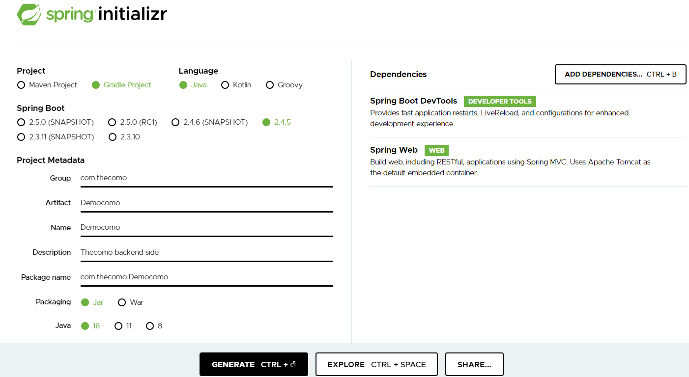
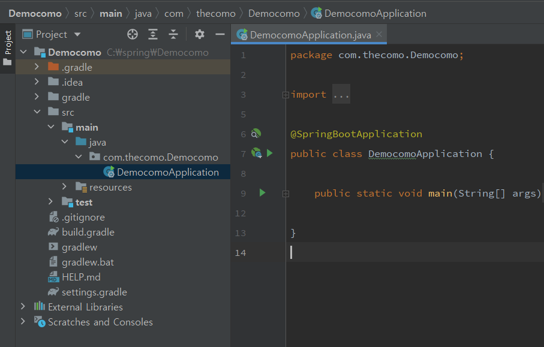
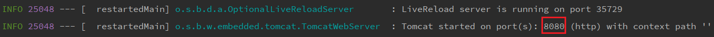

## 들어가기 전에

현재 소속되어 있는 연구실에서 마음이 맞는 사람들과 하나의 프로젝트를 구상했다.

가칭 <strong>더커모</strong>, 더 나은 커뮤니티를 만드는 모임이다.😜

 
현재 대학생이 가장 애용하는 커뮤니티인 에브리타임은 강력한 익명성을 보장한다.

하지만 그 익명성을 악용해 게시판, 나아가 학교 전체의 분위기를 흐리는 일이 많이 일어났다.

따라서 우리는 [블라인드](https://www.teamblind.com/kr/)를 참고하여, 소속된 학부 등과 같이

최소 정보를 노출해 익명성은 보장하되 글 작성 시 한번 더 재고할 수 있는 웹 커뮤니티를 만들고자 한다.

  

## Java는 사용할 줄 알지만...?

프론트엔드와 마찬가지로 스프링부트 또한 사용해 본 적은 없다. (RDBMS나 NoSQL만 조금...?)

이번 프로젝트에서 백엔드 기술 스택은 Spring boot + MySQL로 정했으므로, 무작정 따라하면서 배울 곳이 없나 찾아다녔는데,

인프런의 [스프링 입문 강의](https://www.inflearn.com/course/%EC%8A%A4%ED%94%84%EB%A7%81-%EC%9E%85%EB%AC%B8-%EC%8A%A4%ED%94%84%EB%A7%81%EB%B6%80%ED%8A%B8/dashboard)가 정말 좋은 것 같아 그대로 따라가면서 공부하고자 한다!

  

## 첫 번째 걸음

프론트엔드를 ~~~자연스럽게~~~ 전담하게 된 프로젝트에서 백엔드를 염두에 두고 설치했던 `IntelliJ`를 그대로 IDE로 활용하고,

`Gradle`은 Java 토이 프로젝트를 여러 개 진행하면서 익숙하게 쓴 빌드 툴이므로 사전 설치는 금방 끝났다.

 

사용한 도구들의 버전은 다음과 같다.

- Gradle 6.7
- Java 15.0.2
- IntelliJ IDEA 2021.1 (Ultimate edition)

 

[스프링부트 스타터 사이트](https://start.spring.io/)로 가서 프로젝트를 생성한다.

 
{:.border.lead width="701" height="390" loading="lazy"}
조만간 Java 16으로 업데이트해야 할 것 같아...
{:.figcaption}

 
Gradle 프로젝트로 생성하고, 종속성에 개발 툴과 `Spring Web`을 추가한다.

`Thymeleaf`과 같은 템플릿 엔진은 필요 없을 것 같았는데 (프론트엔드 담당이 React와 Typescript를 사용할 예정이다)

처음 프론트엔드를 데모로 만들어보면서 어떻게 동작하는지 파악하는데 좋겠다 싶어 뒤늦게 추가했다.

 

저렇게 종속성을 추가하고 GENERATE 버튼을 누르면 프로젝트 zip 파일이 생성된다.

 

`IntelliJ`에서 이 파일을 임포트하면 처음에 종속성 등을 다운받느라고 초기 설정에 시간이 꽤 걸린다.

  

{:.border.lead width="907" height="579" loading="lazy"}

 
프로젝트의 구조는 다음과 같고, `IntelliJ` 상단의 Run 버튼이나 main 메소드 옆 Run 버튼으로 실행할 수 있다.

  

{:.border.lead width="1357" height="72" loading="lazy"}

 
실행하면 스프링 부트가 8080 포트로 실행되며, `localhost:8080`으로 접속하면 화이트 라벨 에러가 성공적으로~~~(?)~~~ 뜬다.

즉, 내장된 톰캣 서버를 실행하면서 스프링 부트가 동작하는 방식이다.

`React`가 `localhost:3000`으로 실행되는 것처럼.

  

처음 작디작은 단계를 지났다.

강의를 따라가면서 계속 공부하고, 프로젝트에 적용시켜

실제로 교내 커뮤니티 프로젝트에 적합하도록 설계해야겠다.😃

