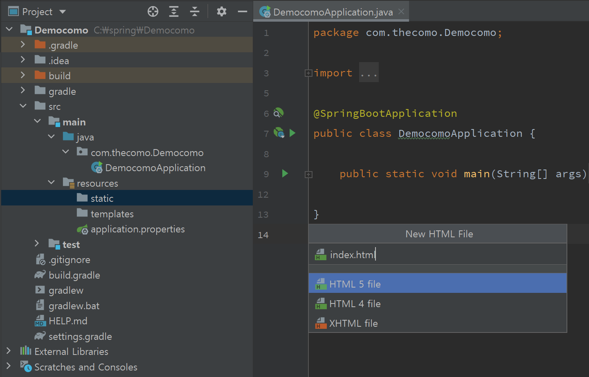
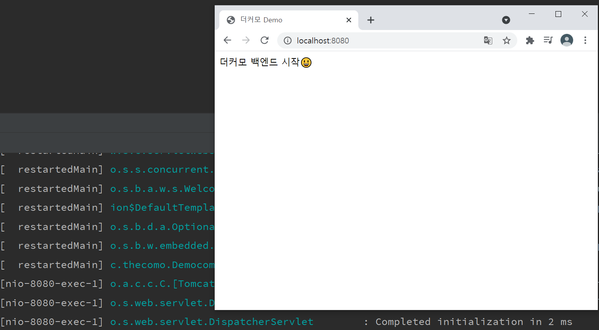
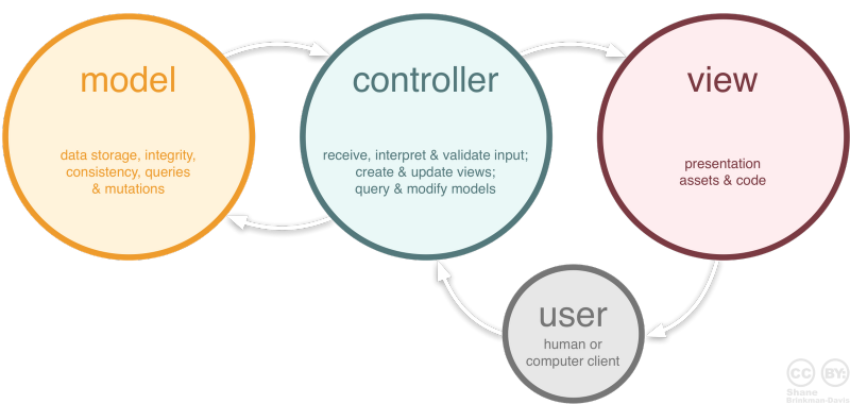
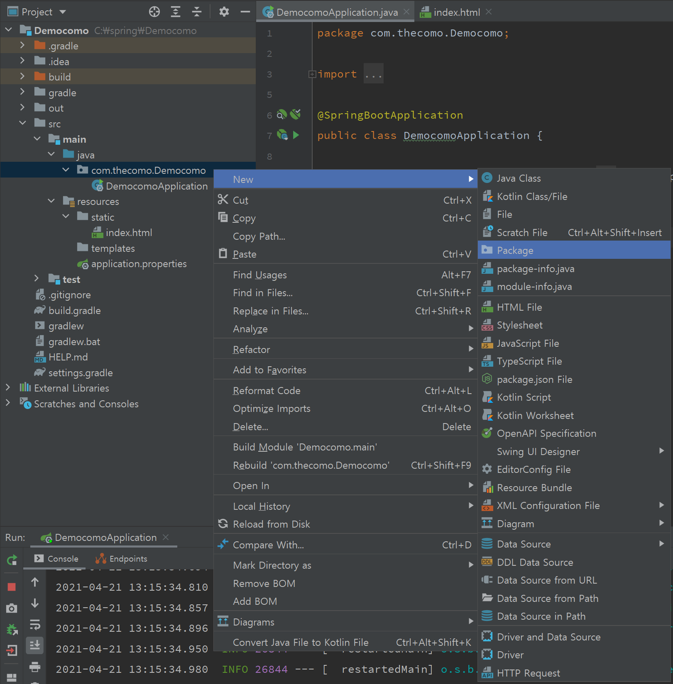
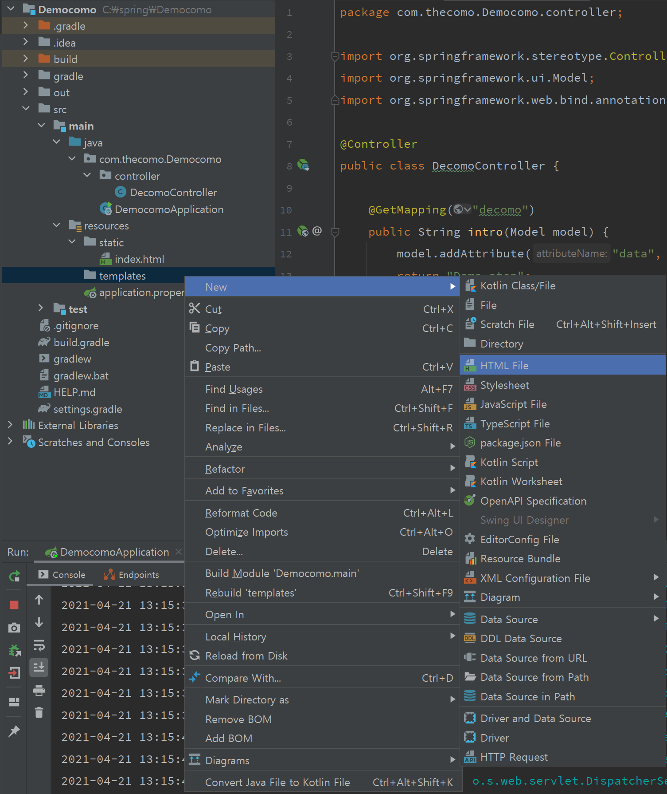
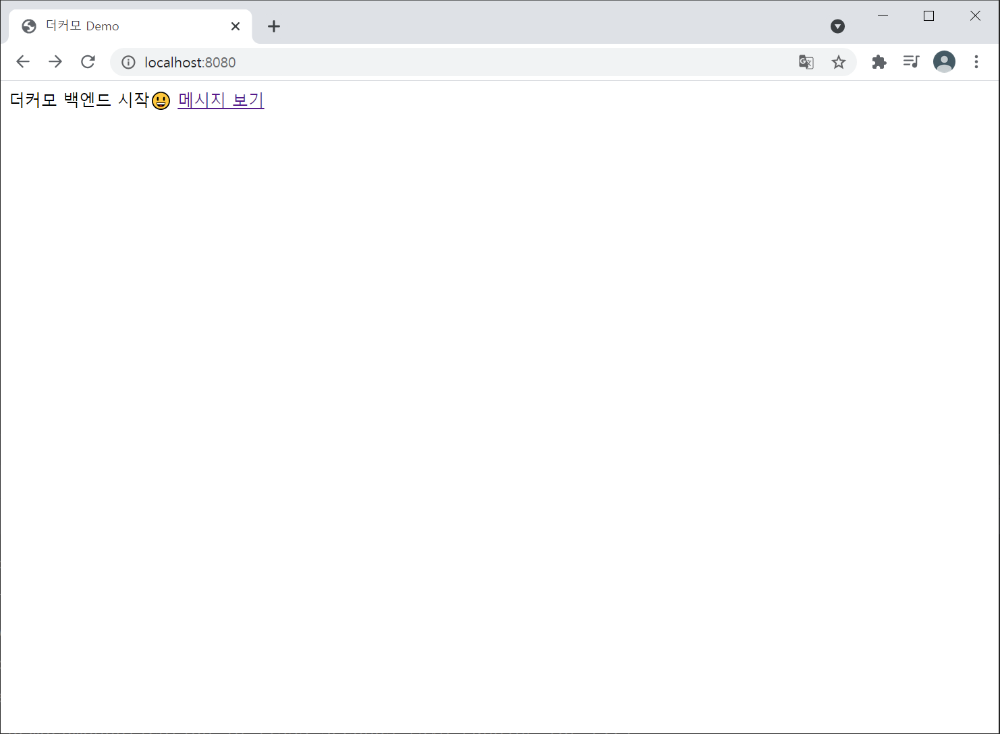
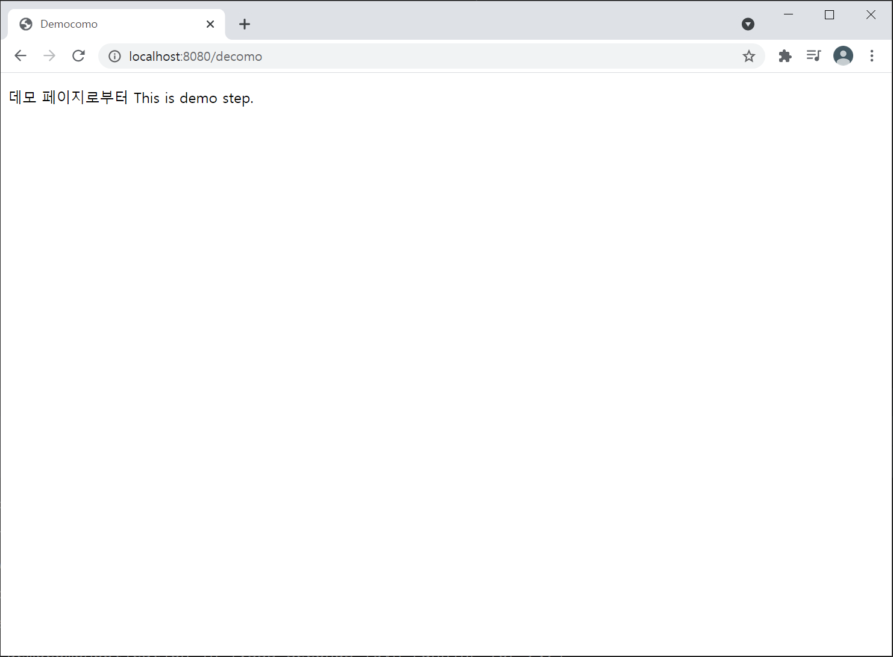

본격적으로 프로젝트에 뛰어들기 전 스프링부트에 익숙해지고 스스로 설계하면서 구조를 파악하기 위해 공부하는 포스트입니다.

## 정적 페이지 만들기

이전에 화이트라벨 에러 페이지만 띄워 봤는데, HTML 파일을 작성해 출력해보도록 하자.

 
{:.border.lead width="720" height="462" loading="lazy"}

  

만드는 과정은 정말 쉽다. 프로젝트 내 `/resources/static` 경로에 `index.html` 파일을 생성한다.

~~~html
// file: 'index.html'
<!DOCTYPE html>
<html lang="en">
<head>
    <meta charset="UTF-8">
    <title>더커모 Demo</title>
</head>
<body>
더커모 백엔드 시작😃
</body>
</html>
~~~

 

부트를 재시작하면 화이트라벨 에러 페이지 대신 작성한 html 정적 페이지가 완성된다

 

{:.border.lead width="780" height="422" loading="lazy"}

  

## 정적 페이지로는 부족해

정적 페이지로만 웹 사이트를 구성하긴 어렵다.

공부하면서도 그렇고, 프로젝트에서도 MVC 디자인 패턴을 사용해 설계할 계획인데,

MVC 패턴이란 프로젝트 내에서 Model, View, Controller의 역할을 구분하여 디자인하는 것이다.

{:.border.lead width="780" height="422" loading="lazy"}

 
- Model: 데이터의 정보를 가지며 이를 가공하거나 변경하는 역할.
- View: 사용자에게 보여지는 컴포넌트. 화면에 데이터를 받아 표현해주며 따로 저장해서는 안 된다.
- Controller: 사용자의 이벤트를 처리하며, Model과 View를 잇는 역할.

 

MVC 패턴으로 설계하기 위한 첫 단계로 Controller를 만들어보자.

{:.border.lead width="800" height="800" loading="lazy"}

 
`Main Application`과 구분하기 위해서 패키지를 선언해주고,

  

~~~java
// file: 'DecomoController.java'
package com.thecomo.Democomo.controller;

import org.springframework.stereotype.Controller;
import org.springframework.ui.Model;
import org.springframework.web.bind.annotation.GetMapping;

@Controller
public class DecomoController {

    @GetMapping("decomo")
    public String intro(Model model) {
        model.addAttribute("data", "This is demo step.");
        return "decomo";
    }
}
~~~

 

위와 같이 작성한다.

`DecomoController`는 decomo 경로로 들어온 이벤트를 처리하는 역할을 하며,

위 데이터대로 `name`이 `data`인 `Attributte`에 값을 매핑하고 `model`에 저장한다.

처음에 `return "decomo";` 부분을 단순 String인 줄 알고 아무거나 적었는데 Controller가 실행되지 않았다.

 

~~`GetMapping()`으로 매핑한 경로와 같아야 정상적으로 인식하는 것 같다.~~

🔥 Controller에서 리턴 값으로 문자열를 반환하면, `viewResolver`가 화면을 찾는다.

즉, `resources:templates/` + 리턴한 문자열 + `.html`으로 파일을 찾는다고.

나는 `resources/templates`에 `decomo.html`을 만들었으므로, decomo로 리턴해야 리졸버가 해당 html파일을 찾을 수 있더랜다.

  

{:.border.lead width="800" height="800" loading="lazy"}

그 다음 `/resources/templates`에 `decomo.html` 파일을 생성하고 다음과 같이 작성한다.

 

~~~html
// file: 'decomo.html'
<!DOCTYPE html>
<html xmlns:th="http://www.thymeleaf.org">
<head>
    <meta http-equiv="Content-Type" content="text/html" charset="UTF-8">
    <title>Democomo</title>
</head>
<body>

 메시지가 도착했습니다. 

</body>
</html>
~~~

`th` 태그는 템플릿 엔진 `Thymeleaf`에서 제공하며, html처럼 코딩할 수 있도록 만들어준다.

`${data}`는 이전에 추가했던 `model`의 `Attribute name` 중 `data`에 맞는 값을 가져와 이어 붙여준다.

 

이벤트를 만들어주기 위해 `index.html`에 decomo로 이동시켜주는 `a` 태그를 추가한다.

 

~~~html
// file: 'index.html'
<!DOCTYPE html>
<html lang="en">
<head>
    <meta charset="UTF-8">
    <title>더커모 Demo</title>
</head>
<body>
더커모 백엔드 시작😃
<a href="/decomo">메시지 보기</a>  <!-- New! -->
</body>
</html>
~~~

 

작성 후 부트를 재시작하면,

 

{:.border.lead width="800" height="800" loading="lazy"}

생성된 링크를 누르면? 
{:.figcaption}

 

{:.border.lead width="800" height="800" loading="lazy"}

 

`Controller`가 `View`에서 사용자가 누른 이벤트를 처리하고 `Model`에 저장된 데이터를 받아와(= GetMapping) 다시 `View`에게 넘겨준다.

`View`는 `${data}`로 요구한 데이터를 정상적으로 받아와 출력한다.

  

다음 포스트부터 본격적으로 정적 컨텐츠, MVC, API 사용법을 공부하고 내 것으로 만들 예정이다!😆
