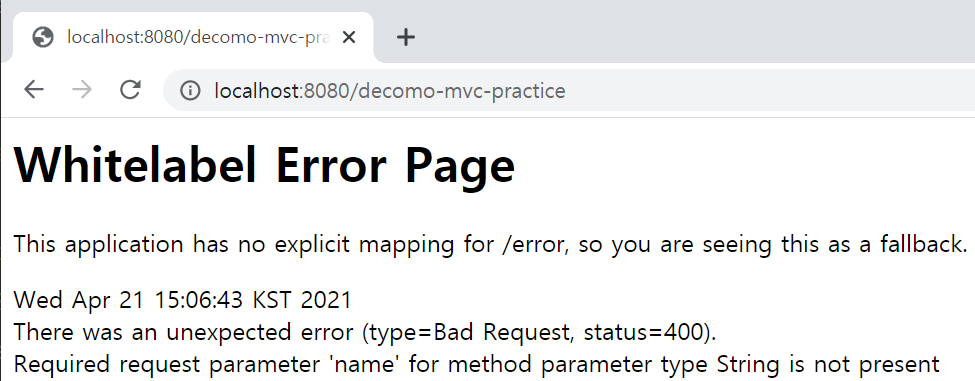
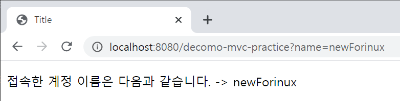
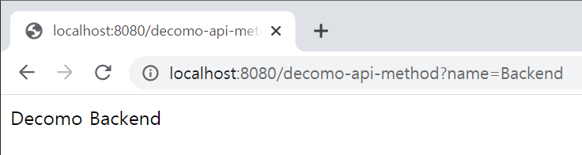
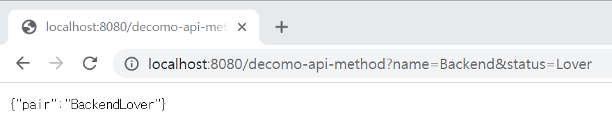

본격적으로 프로젝트에 뛰어들기 전 스프링부트에 익숙해지고 스스로 설계하면서 구조를 파악하기 위해 공부하는 포스트입니다.

  

## 정적 페이지, MVC, API?

정적 페이지란 이전에 구현했던 `index.html`처럼 파일을 그대로 출력해주는 방식이다.

MVC란 이전에 공부했던 것처럼 Model, View, Controller과 같이 역할을 나눠서 디자인하는 방식이고,

API는 Vue,js, React와 같이 데이터를 내려주면 클라이언트가 화면을 그리고 정리하는 방식,

프로젝트의 프론트엔트를 담당하면서 API 방식으로 개발했다. (React 사용하면서)

 

## 정적 페이지
`resources/static`에 `html` 파일을 작성해서 서버에 전달하는 방식이다.

URL은 파일명을 붙여 바로 접근할 수 있다.

데이터를 따로 주고받지 않고 그대로 반환된다.

웹 브라우저에서 `html`파일을 톰캣 서버에 요청하면 스프링 컨테이너에서 파일을 찾는데,

이 정적 페이지에 대한 Controller가 없으므로 `resources/static`에서 찾고 이를 브라우저에 반환한다.

  

## MVC, 템플릿 엔진

Model 1 방식에서는 `View`와 `Controller`를 따로 구분하지 않고 `View`에서 많은 일을 수행했으나,

MVC 패턴에서는 각자 역할에 집중하여 효율성을 높인다.

 

이전에 만든 `DecomoController`에 매핑을 추가해보도록 하자.

 

~~~java
// file: 'DecomoController.java'

    @GetMapping("decomo")
      public String intro(Model model) {
          model.addAttribute("data", "This is demo step.");
          return "decomo";
      }
    
    // New!
    @GetMapping("decomo-mvc-practice")
    public String decomoMVC(@RequestParam("name") String name, Model model) {
        model.addAttribute("name", name);
        return "decomo-temp";
    }
}
~~~

 
이번엔 매개변수를 받는다.

`@RequestParam`이란 어노테이션을 통해 attribute name이 name인 문자열을 받아 Model에 추가한다.

그리고 `decomo-temp` 문자열을 리턴하여 `viewResolver`가 이 이름과 같은 `html`파일을 `resources/template`에서 찾을 것이다.

그렇다면 만들어 줘야겠지?

  

~~~html
<!-- file: 'decomo-temp.html' -->
<!DOCTYPE html>
<html xmlns:th="http://www.thymeleaf.org">
<head>
    <meta charset="UTF-8">
    <title>Title</title>
</head>
<body>

 ' + ${name}"> 반가워요! 

</body>
</html>
~~~

 

`decomo-temp.html`에서 Model의 attribute name이 `name`인 값을 받아와 `p` 태그에 내용을 치환해준다.

부트를 재시작해보자.

`GetMapping`에서 들어갈 url이 `decomo-mvc-practice`이므로, `localhost:8080/decomo-mvc-practice`를 입력해 들어가보면,

  

{:.border.lead width="975" height="381" loading="lazy"}

<strong>화이트라벨 에러 페이지가 뜬다.</strong>

 

🔥 `@RequestParam`은 default가 `required=true`이기 때문에, 매개변수를 주지 않아 발생하는 오류다.

따라서 매개변수를 꼭 주지 않아도 된다면

~~~java
// file: 'DecomoController.java'

    public String decomoMVC(@RequestParam(value = "name", required = false) String name, Model model) {
      ...
~~~

이렇게 변경하거나,

 

url 끝에 `?{attribute_name}={parameter}` 형식으로 매개변수를 넣어 줘야 한다.

 

{:.border.lead width="782" height="119" loading="lazy"}

 

이렇게 넣어주면, 매개변수를 잘 받아와 출력된다.

  

MVC의 동작 방식은 웹 브라우저가 해당 url로 내장 톰캣 서버에 요청하면

서버가 컨테이너에서 `Controller`를 찾고, `Controller`가 리턴한 문자열을 `viewResolver`가 똑같은 파일을 찾아 서버로 넘겨준다.

  

## API

MVC는 `View`를 찾아 넘겨주는 방식이고, API는 데이터를 넘겨주는 방식으로 이해하면 편할 것 같다.

`Controller`에 다음과 같이 추가한다.

~~~java
// file: 'DecomoController.java
import org.springframework.stereotype.Controller;
import org.springframework.ui.Model;
import org.springframework.web.bind.annotation.GetMapping;
import org.springframework.web.bind.annotation.RequestParam;
import org.springframework.web.bind.annotation.ResponseBody;

@Controller
public class DecomoController {

    @GetMapping("decomo")
    public String intro(Model model) {
        model.addAttribute("data", "This is demo step.");
        return "decomo";
    }

    @GetMapping("decomo-mvc-practice")
    public String decomoMVC(@RequestParam(value = "name", required = false) String name, Model model) {
        model.addAttribute("name", name);
        return "decomo-temp";
    }

    // New!
    @GetMapping("decomo-api-method")
    @ResponseBody
    public String decomoAPI(@RequestParam("name") String name) {
        return "Decomo " + name;
    }
}
~~~

`@ResponseBody`는 HTTP response의 `body` 부분에 데이터를 직접 넣어주겠다는 의미다.

역시 매개변수를 요구하므로 `localhost:8080/decomo-api-method?name=Backend`를 입력해 보면,

 

{:.border.lead width="736" height="196" loading="lazy"}

 

잘 출력된다.

페이지 소스를 확인해보면 이전의 정적 컨텐츠, MVC와 달리 저 문자열만 달랑 존재한다.

데이터만 넘겨주기 때문!

 

하지만 문자열만 넘겨주면 굉장히 쓸 데가 없다.

데이터를 넘겨받도록 새로운 데이터 객체를 선언하자.

 

~~~java
// file: 'TrivialObject.java
public class TrivialObject {
    private String name;
    private String status;
    
    public trivialObject(String name, String status) {
        this.name = name;
        this.status = status;
    }
    
    public String getPair() {
        return name + status;
    }
}
~~~

 

trivialObject 클래스는 생성자를 통해 private field의 값을 받고,

`getPair()` 메소드를 통해 두 필드를 합쳐 리턴하는 굉장히 간단한 객체다.

 

다음, `Controller`로 돌아가서 객체를 받도록 수정하자.

 

~~~java
// file: 'DecomoController.java'

    ...

    @GetMapping("decomo-api-method")
    @ResponseBody
    public TrivialObject decomoAPI(@RequestParam("name") String name, @RequestParam("status") String status) {
        TrivialObject trivial = new TrivialObject(name, status);
        return trivial;
    }
    
    ...
~~~

리턴 값이 객체이므로 `TrivialObject`로 변경하고, 2개의 매개변수를 각각 `name`, `status`로 받는다.

이를 constructor를 통해 넘겨주고 객체를 리턴한다.

 

2개의 파라미터를 받는 방법 또한 간단했다.

`${parameter name1}={value1}&{parameter name2}={value2}...` 이렇게 넣어주면 된다.

 

{:.border.lead width="880" height="190" loading="lazy"}

그럼 `key-value` 형식으로 출력된다.

`key` 값이 `pair`길래 우연의 일치인가 했는데, `TrivialObject`의 `getPair()` 메소드를 수정하면 다르게 나온다!

`get` 이후의 이름으로 `key`값이 자동으로 정해지는 것 같다😮

 

API 동작 방식은, 브라우저가 해당 url로 서버에 요청하면, 서버가 컨테이너의 `Controller`를 찾는다.

`Controller`가 확인해보니 `@ResponseBody`라는 어노테이션을 발견했다.

그러면 HTTP response의 `body`에 데이터를 직접 반환한다.

이 때 `HttpMessageConverter`가 동작하는데, 단순 문자열일 경우 `SpringConverter`가 동작한다.

 

<strong>객체일 경우</strong>, `MappingJackson2HttpMessageConverter`가 동작하면서 객체를 `JSON`형식으로 바꾼 다음 브라우저에게 보내준다.

`JSON` 처리 시 [Jackson](https://github.com/FasterXML/jackson)을 사용하는데, 채점 서비스 엔진을 만들면서 `Gson`과 `Jackson`을 놓고 심각하게 고민했던 나로서는 반가운 이름이었다.

 

클라이언트 쪽에서 보낸 `Accept` 헤더와 서버의 `Controller` 리턴 타입을 조합해서 Converter가 선택된다고 하는데,

React에서 `Content-Type: multipart/form-data` 등과 같이 보내려고 하는 데이터 타입을 지정해줬던 것이 새록새록 기억이 난다.

  

백엔드 개발 시 사용하는 개발 방식을 공부했는데, 무심코 사용했던 방법이 많았다.

이게 그 방식이었구나 여러 번 리마인드하게 됐다😅

