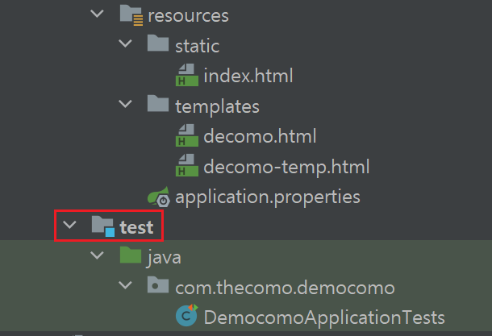
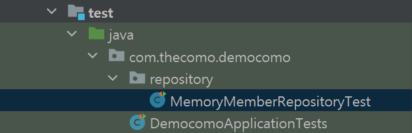
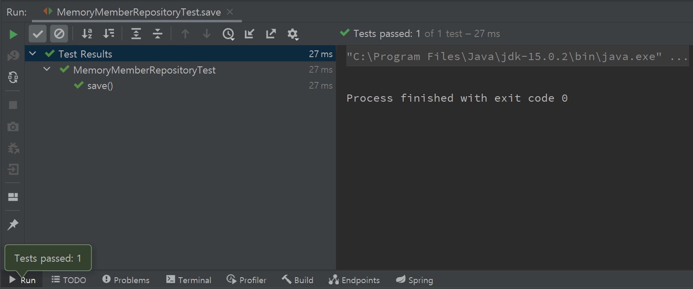
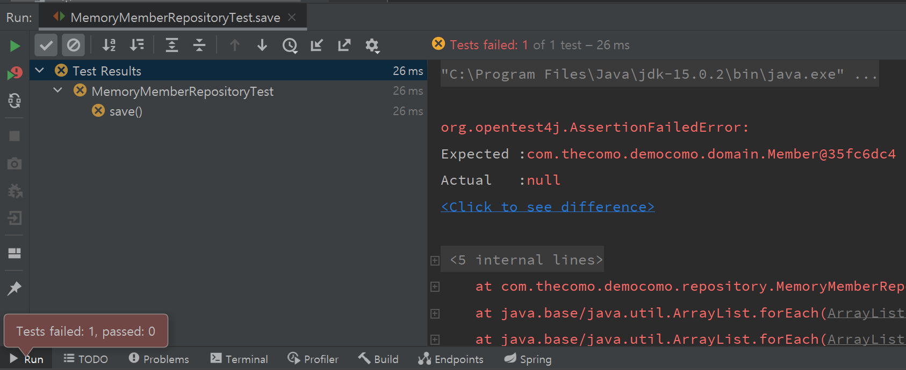

본격적으로 프로젝트에 뛰어들기 전 스프링부트에 익숙해지고 스스로 설계하면서 구조를 파악하기 위해 공부하는 포스트입니다.

  

## 회원 도메인, 레포지토리 만들기

 

이전에 만들었던 `com.thecomo.democomo` 패키지에서 `domain` 패키지를 추가하고, `Member` 클래스를 작성한다.

 

~~~java
// file: 'Member.java'
package com.thecomo.democomo.domain;

public class Member {

    private Long id;
    private String name;

    public Long getId() {
        return id;
    }

    public void setId(Long id) {
        this.id = id;
    }

    public String getName() {
        return name;
    }

    public void setName(String name) { 
        this.name = name; 
    }
}
~~~

 

회원 식별용 아이디와 이름만 있는 간단한 클래스다.

getter, setter 또한 만들어준다.

  

다음은 이 `Member` 정보를 가지고 있는 저장소 클래스를 만든다.

그 전에 인터페이스를 구현하여 이 저장소 클래스가 어떤 메소드를 구현해야 하는지, 제약조건을 걸고 가자구😉

 

~~~java
// file: 'MemberRepository.java'
package com.thecomo.democomo.repository;

import com.thecomo.democomo.domain.Member;

import java.util.List;
import java.util.Optional;

public interface MemberRepository {
    Member save(Member member);

    //Optional --> (Java 8에 추가된 기능) null일수도 있으니까
    Optional<Member> findById(Long id);
    Optional<Member> findByName(String name);
    List<Member> findAll();
}
~~~

 

`Optional` 클래스로 감싸준 것은 `<>` 부분 내의 객체가 `null`일 수도 있다는 것을 알려준다.

`null-check` 또한 이 클래스로 위임해버리는, `null-safety` 객체라고 하는데...

아직까지는 확 와닿지 않아서, 주시 대상 리스트에 넣도록 하자.

  

다음은 이 인터페이스를 바탕으로 구체화하는 클래스를 작성한다.

 

~~~java
// file: 'MemoryMemberRepository.java'
package com.thecomo.democomo.repository;

import com.thecomo.democomo.domain.Member;

import java.util.*;

public class MemoryMemberRepository implements MemberRepository {

    //동시성 문제 -> thread-safe?
    //concurrentHashmap을 써야 함
    private static Map<Long, Member> store = new HashMap<>();

    //AtomicLong (동시성 문제)
    private static long sequence = 0L;

    ...
    
~~~

 

여기서부터 짚고 넘어가자.

강의에서는 간단한 예제이므로 각각 `Map`과 `Long`을 썼지만,

현업에서는 `ConcurrentHashMap`과 `AtomicLong`을 써야 한다고 한다.

처음 보자마자 ~~띠용?~~이게 뭐지?😳 했으나, 찾아보니 <strong>동시성 문제</strong>를 해결하기 위한 클래스 / 타입이라고.

 

`ConcurrentHashMap`은 기존 `HashMap`과 기능적으로 거의 같으나, <strong>thread-safe</strong>하며, `HashMap`과 다르게 key-value에서 `null`을 허용하지 않는다.

`AtomicLong` 또한 Long과 같은 자료형임과 동시에 <strong>thread-safe</strong>하다.

 

그럼 <strong>thread-safe</strong>이 대체 뭘까?

사실 정말 간단한 거였다. 멀티 스레드 환경에서 여러 스레드가 동시에 함수, 변수, 객체 등에 접근해도 문제가 없는 것이다.

변수가 다른 스레드에 의해 작업/변경되고 있고 다른 스레드는 그걸 모른 채 작업을 수행했다면, 원래 의도와는 다르게 실행될 위험이 있다.

따라서 이런 동시성 문제를 해결하기 위해 위와 같은 클래스와 자료형을 사용하는 것이며,

별도의 동기화(synchronized) 없이, 적은 비용으로 동시성을 보장할 수 있다.

 

🔥 생각해보니 jChecker 프로젝트 또한 여러 사람들이 동시에 접속하는 서비스이므로 분명 동시성 문제가 발생할텐데, 아직까지 별다른 이슈가 없었다.

접속하는 스레드 수가 그렇게 많지 않아서일까, 아니면 멀티 스레드마다 엔진의 jar파일을 실행시키므로 문제가 없는 것일까.

혹시 모르니 엔진 쪽에서 `HashMap`이나 기타 자료형들을 동시성을 보장하는 클래스, 자료형으로 변경해야겠다.

  

## 테스트 주도 개발(Test-Driven Development)?!

이렇게 만들고 나서, 잘 동작하는지 확인하고 싶다.

웹으로 확인할 수는 있겠지만, 다른 좋은 방법이 없을까?

이 때 우리는 테스트 케이스를 만들 수 있다. 이것이 현업에서도 그렇게 중요하다는 테스트 주도 개발..!

테스트 케이스를 작성해서, 코드를 코드로 검증할 수 있다!

 

{:.border.lead width="610" height="417" loading="lazy"}

 

여기 이 `test`에서 테스트 케이스를 작성할 수 있다. (jUnit 프레임워크가 있다면 반드시 있을 것!)

 

{:.border.lead width="696" height="255" loading="lazy"}

 

우리가 테스트하려고 하는 클래스는 `MemoryMemberRepository`이므로 이 클래스의 패키지를 선언하고,

`MemoryMemberRepositoryTest`라는 테스트 클래스를 선언한다.

관행적으로 테스트하려는 클래스 이름 + Test를 붙여 네이밍한다고.

 

그리고 아래와 같이 작성한다.

 

~~~java
// file: 'MemoryMemberRepositoryTest.java'
package com.thecomo.democomo.repository;

import com.thecomo.democomo.domain.Member;
import org.junit.jupiter.api.Test;

import static org.junit.jupiter.api.Assertions.*;

class MemoryMemberRepositoryTest {

    MemoryMemberRepository repository = new MemoryMemberRepository();

    @Test
    public void save() {
        Member member = new Member();
        member.setName("Admin");

        repository.save(member);

        // Optional에서 그냥 get으로 꺼내는 것은 좋은 방법이 아님
        Member result = repository.findById(member.getId()).get();
        assertEqual(result, member);
    }
}
~~~

 

`@Test` 어노테이션을 테스트하려는 메소드 위에 선언한다.

위 코드는 `jUnit`의 `Assertions`를 <strong>static import</strong>했으므로 `assertEquals`만 적을 수 있게 되었다.

`assertEquals`는 `assertEquals(expected, actual)`이므로 첫 번째 매개변수는 테스트 케이스를, 두 번째 매개변수는 테스트하려는 객체를 넣어주면 된다.

 

요즘에는 `assertEquals`보다 `assertj`의 `assertThat`을 많이 쓴다고 하는데,

다시 작성해보면,

 

~~~java
// file: 'MemoryMemberRepositoryTest.java'

import static org.assertj.core.api.Assertions.*;

  ...

  Member result = repository.findById(member.getId()).get();
  assertThat(member).isEqualTo(result);
        
  ...
~~~

 

`assertThat`을 저렇게 사용할 수 있다.

역시 `assertj`의 `Assertion`을 static import해서 `assertThat`만 적었고,

`assertThat`은 직후의 매개변수가 `isEqualTo` 메소드로 테스트 케이스와 같은지 확인하기 때문에

이해하기는 더 쉬운 것 같다.

 

이렇게 다양한 메소드를 `@Test` 어노테이션과 `assert`로 확인할 수 있으며,

테스트를 통과하면

 

{:.border.lead width="825" height="344" loading="lazy"}

 

콘솔 창에 Pass가 뜨고,

  

{:.border.lead width="843" height="350" loading="lazy"}

 

실패하면 사정없이 틀렸다는 것을 알려준다.

 

이렇게 다양한 메소드를 테스트 케이스로 확인할 수 있어 오류를 미리 확인할 수도 있고, 디버깅하기 편할 것 같다.

계속해서 TDD로 진행하는 습관을 들여야겠다✨

 
