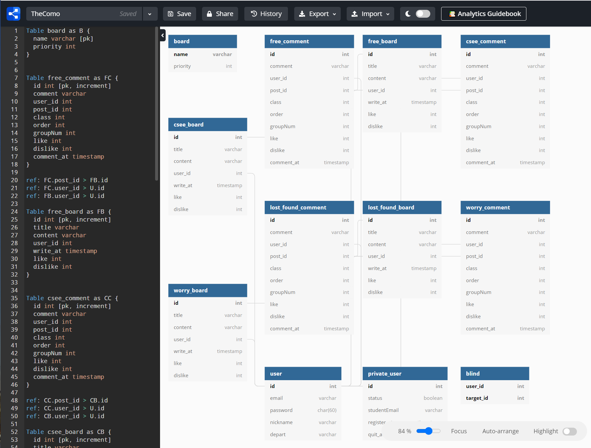

 

<strong>💥설계 이후 필요한 기능 및 잘못된 구성으로 변경이 있어 수정.</strong>

 

데이터베이스를 설계할 때 아주 유용하게 사용한 서비스가 있다.

[dbdiagram](https://dbdiagram.io/d/6076c880b6aeb3052d900f76)인데, 관계형 데이터베이스를 간단한 코드로 설계할 수 있다!

 

{:.border.lead width="901" height="660" loading="lazy"}

이렇게 하면 고치기도 쉽고, 릴레이션 간 관계를 파악하기도 쉽다.

export하면 `.sql`파일로 나와 바로 이식할 수도 있다!

 

## 어떤 릴레이션이 필요한가?

커뮤니티 앱에서 반드시 필요한 것은 다음과 같다.

- 회원 정보
- 게시판
- 게시글
- 댓글
- 대댓글
- 블라인드 기능!

요구사항은 위와 같으며, 게시판은 한 곳에 몰아 넣지 않도록 여러 개로 구성했다.

그럼 회원 정보부터 설계해보자.

 

## 회원 정보 테이블

`user`와 `private_user` 테이블이 있다.

### user 테이블

일반적인 사용자 정보를 저장하는 테이블이다.

회원가입 시 받은 이메일, 비밀번호, 닉네임, 학부를 어트리뷰트로 하며, 하나의 튜플로 저장한다.

이 정보 중 닉네임과 학부는 글 작성, 댓글 및 대댓글 작성 시 노출되는 정보로 한다.

### private_user 테이블

서비스 이용자가 학부생이 운영하는 데이터베이스에 자신의 정보가 저장된다는 것에 거부감을 느낄 수 있으므로,

`user` 테이블과 연관성이 없도록 해야 하며, 현재 활동 중인 회원인지, 탈퇴한 회원인지 확인하는 용도의 테이블이다.

 

어트리뷰트는 ~~`id`,~~ `student_email`, `status`, `register_at`, `quit_at`이며,

학교 인증 시 이메일과 가입일을 저장한다.

#### (🔥 학교 이메일로 계정이 활성 상태인지 확인해야 하며, 자체로 Unique하므로 id를 제거하고 student_email을 PK로 한다.)

탈퇴 시 n일간 재가입 불가를 위해 탈퇴 시 `quit_at` 어트리뷰트 값을 가져와 대조하도록 한다.

 

## board 테이블

여러 게시판의 이름과 우선순위를 저장하는 테이블이다.

우선순위를 받는 이유는, 웹 서비스 시 메뉴 바에 나타나는 순서를 정해주기 위한 것이다.

게시판의 이름은 unique하므로 이를 PK로 설정했다.

 

## free_board 테이블

게시글 리스트를 저장하는 자유게시판으로, 세부 게시판은 대부분 이와 비슷하게 설계했다.

어트리뷰트는 `id`, `title`, `content`, `user_id`, `write_at`, `like`, `dislike`이다.

게시글을 보여줄 때, `write_at` 값 중에서 최신 순으로 정렬하여 보여주도록 한다.

 

베스트 게시물 설계 시, `like`와 `dislike`를 적절하게 고려하여 정렬하도록 한다.

 

## free_comment 테이블

자유게시판에 작성된 모든 댓글, 대댓글을 저장하는 댓글 테이블이다. 세부 게시판 댓글은 대부분 이와 비슷하게 설계했다.

어트리뷰트는 `id`, `user_id`, `comment`, `post_id`, `class`, `order`, `groupNum`, `like`, `dislike`, `comment_at`이다.

- `user_id`: 댓글, 대댓글 작성자 확인
- `post_id`: 댓글, 대댓글이 작성된 원 게시물 확인
- `class`: 댓글, 대댓글 구별을 위함. (`class 0` = 댓글, `class 1` = 대댓글)
- `order`: 댓글을 작성 시점 순으로 정렬하기 위함
- `groupNum`: 댓글의 경우 댓글의 인덱스를, 대댓글의 경우 댓글의 인덱스를 값으로 갖는다. 댓글의 하위 요소를 파악하기 위함

 

## blind 테이블

사용자는 특정 사용자를 블라인드할 수 있는데, 블라인드 설정 시 사용자의 게시글, 댓글, 대댓글을 보이지 않도록 한다.

어트리뷰트는 `user_id`, `target_id`로, `user_id`는 사용자, `target_id`는 해당 사용자가 블라인드한 사용자 id를 말한다.

한 사람이 여러 명을 블라인드할 수 있으므로, Primary Key는 `user_id`와 `target_id`를 묶어 복합키로 만든다.

  

향후 게시판, 서비스 기능을 추가하면서 테이블 추가 설계 또는 재설계가 이루어질 수 있는데, 발생할 때마다 포스트로 다루겠다.

테이블 사용 시나리오도 작성했으니, 백엔드 설계하면서 값이 잘 들어가는지, 관계는 이상이 없는지, 정규화를 만족하는지 체크하면서 진행하면 되겠다.

 

## like, dislike 테이블

사용자는 특정 게시물의 좋아요, 싫어요 버튼을 클릭할 수 있으며, 좋아요 / 싫어요 버튼을 클릭했을 때 상태가 유지되어야 한다.

한 사람이 여러 게시글을 좋아요 / 싫어요 할 수 있으므로 사용자 id와 좋아요 / 싫어요를 누른 게시글의 id를 복합키로 관리해야 한다.

현재 계획은 댓글, 대댓글도 좋아요 / 싫어요 버튼을 구현하는 것이므로, 댓글, 대댓글에 대한 like, dislike 테이블 또한 구성되어야 할 것이다.

 
