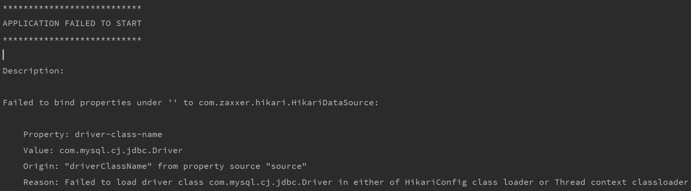
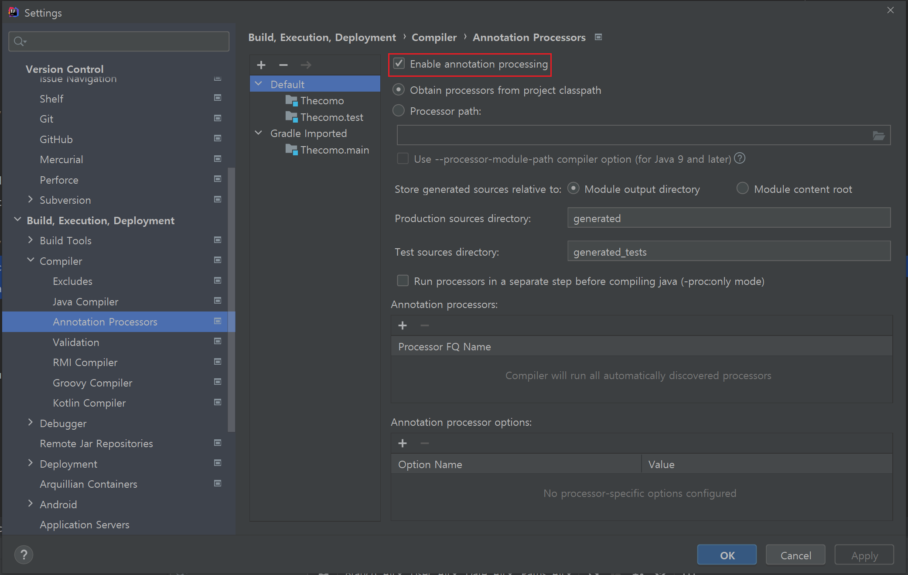
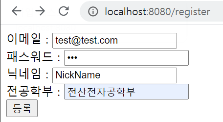
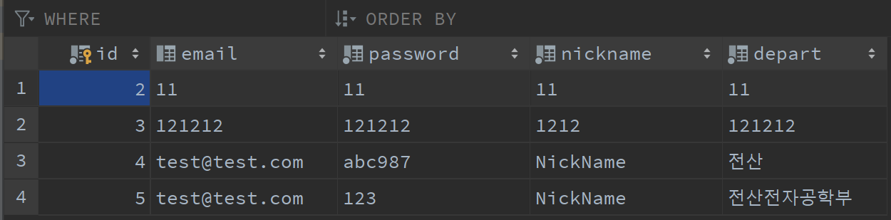

데이터베이스 설계대로, 스프링 부트에서 값을 받아 DB에 넣을 수 있는지 확인한다.

 

## 컨트롤러 만들기

MVC 모델에서 C를 담당하는 객체다.

특정 URL로 get, post 명령 등 요청이 들어왔을 때 `model`을 조작해주는 역할을 한다.

 

~~~java
// file: 'RegisterController.java'

package handong.the.como.controller.api;

import handong.the.como.dto.UserDTO;
import handong.the.como.service.RegisterService;
import org.springframework.stereotype.Controller;
import org.springframework.web.bind.annotation.GetMapping;
import org.springframework.web.bind.annotation.PostMapping;

@Controller
public class RegisterController {

    private RegisterService registerService;

    public RegisterController(RegisterService registerService) {
        this.registerService = registerService;
    }

    @GetMapping("/")
    public String detail() {
        return "detail.html";
    }

    @GetMapping("/register")
    public String register() {
        return "register.html";
    }

    @PostMapping("/register/post")
    public String register(UserDTO userDTO) {
        registerService.saveRegister(userDTO);
        return "redirect:/";
    }
}

~~~

 

`Service` 객체는 요청을 받은 `Controller`가 적절한 처리를 하기 위해 호출한다.

위의 `RegisterService`가 적절한 데이터를 조작 / 가공하여 다시 `RegisterController`에게 전달하고,

`RegisterController`는 이 결과를 클라이언트에게 전달한다.

 

즉, `RegisterService`는 회원 정보를 받아 저장하는 <strong>비즈니스 로직을 담당한다.</strong>

 

프론트엔드와 나눠서 작업하고 있지만, 테스트 겸 html 코드를 작성해 `resources/static`폴더에 넣고 실행할 것이다.

`detail.html`과 `register.html`을 작성했지만, Thymeleaf 엔진을 따로 추가하지 않아 `<a href>` 코드가 먹히지 않길래
  
매뉴얼하게 `localhost:8080/register`로 입력해서 들어갔다.~~register.html만 사용했단 이야기~~
 
 

~~~html
<!-- file: 'detail.html' -->
<!DOCTYPE html>
<html lang="en">
<head>
  <meta charset="UTF-8">
  <title>가입 테스트</title>
</head>
<body>
<form action="/register/post" method="post">
  이메일 : <input type="text" name="email">  
  패스워드 : <input type="password" name="password">  
  닉네임 : <input type="text" name="nickname">  
  전공학부 : <input type="text" name="depart">  

  <input type="submit" value="등록">
</form>
</body>
</html>

~~~

 

굉장히 간단한 코드로, 서비스 가입 시 필요한 데이터를 입력받으며,

제출 버튼을 누르면 백앤드에 `/register/post` 라는 URL로 POST 요청을 보낸다.

 

`Controller`의 `@PostMapping` 쪽에서 `/register/post` URL에 대한 처리를 받으며

`UserDTO`라는 <strong>데이터 전송 객체(Data Transfer Object)</strong>를 넘겨받아 서비스를 시작한다.

만약 서비스가 원활히 실행되면, `/`로 리다이렉트하는 코드다.

  

## 서비스 구현하기

서비스는 컨트롤러에 의해 호출되며 데이터의 적절한 가공을 담당한다.

~~~java
// file: 'RegisterService.java'

package handong.the.como.service;

import handong.the.como.dto.UserDTO;
import handong.the.como.repository.UserRepository;
import org.springframework.beans.factory.annotation.Autowired;
import org.springframework.stereotype.Service;

import javax.transaction.Transactional;
import java.util.concurrent.atomic.AtomicLong;

@Service
public class RegisterService {

    private UserRepository userRepository;

    @Autowired
    public RegisterService(UserRepository userRepository) {
        this.userRepository = userRepository;
    }

    @Transactional
    public long saveRegister(UserDTO userDTO) {
        return userRepository.save(userDTO.toEntity()).getId();
    }
}
~~~

 

`Repository`란 JPA에서 사용하는 데이터베이스 레이어 접근자다.

`User` Entity로 데이터베이스에 접근할 수 있도록 하는 클래스로, `JpaRepository`를 상속받을 것이다.

 

이 접근자인 `UserRepository`를 선언해 주고, `@Autowired` 어노테이션을 사용해 의존 객체를 자동으로 주입한다.

 

#### 🔥 의존성 주입이란(Dependency Injection)?

객체가 필요로 하는 특정 객체를 `Constructor` 또는 `setter`로 주입하는 것을 말한다.

`new` 키워드를 사용해 객체를 생성하면 강한 의존관계가 만들어지는데, 이는 이후 높은 비용의 유지 보수가 필요하다.

따라서 객체 간 결합도를 약하게 하기 위해 의존성 주입을 사용한다.

위 `@Autowired` 어노테이션 또한 `Constructor`를 통해 의존성을 주입하는 코드 위에 존재하는데,

생성자를 통한 <strong>`<constructor-arg>`</strong>, setter를 통한 <strong>`<property>`</strong> 태그를 설정 파일에 따로 적어주지 않아도 매핑할 수 있도록 한다.
  
 

[Advice](../assets/img/blog/backend/advice.png){:.border.lead width="901" height="660" loading="lazy"}

 

현직 박사님께 여쭤본 내용을 여기서 마주치니 너무 반갑다😆

 

이어서, `@Transactional` 어노테이션을 붙여 <strong>선언적 트랜잭션</strong>을 선언, 처리할 수 있도록 한다.

데이터베이스의 상태를 변경하거나 한꺼번에 수행되어야 하는 연산을 트랜잭션이라고 하며,

여기서 넘겨받은 회원 정보 전달 객체를 저장하는 `saveRegister`에 붙였다.

  

## Entity와 Repository 선언하기

`Entity`란 데이터베이스의 테이블과 매핑되는 객체로, 해당 테이블의 어트리뷰트 값을 가지고 있다.

따라서 `User` 객체가 `user` 테이블과 매핑되어야 하며, `saveRegister` 트랜잭션 실행 시 하나의 튜플이 생성되어야 한다.

 

~~~java
// file: 'User.java'
package handong.the.como.domain.entity;

import lombok.AccessLevel;
import lombok.Builder;
import lombok.Getter;
import lombok.NoArgsConstructor;

import javax.persistence.*;
import java.util.concurrent.atomic.AtomicLong;

@Getter
@Entity
@Table(name = "user")
@NoArgsConstructor(access = AccessLevel.PROTECTED)
public class User {

    @Id @GeneratedValue(strategy = GenerationType.IDENTITY)
    private long id;

    @Column(length = 255, nullable = false)
    private String email;

    @Column(length = 60, nullable = false)
    private String password;

    @Column(length = 10, nullable = false)
    private String nickname;

    @Column(length = 60, nullable = false)
    private String depart;

    @Builder
    public User(long id, String email, String password, String nickname, String depart) {
        this.id = id;
        this.email = email;
        this.password = password;
        this.nickname = nickname;
        this.depart = depart;
    }
}
~~~

 

`@Entity` 어노테이션으로 이 객체가 테이블과 매핑된다는 것을 알린다.

`@Table(name = "user")` 로 현재 연결된 데이터베이스의 테이블 이름을 명시했는데, 쓰지 않으면 자동으로 객체 이름과 매핑된다. (없으면 만든다)

 

🔥Entity 객체의 `AccessLevel`를 PRIVATE로 해줬더니 오류가 나서 찾아봤는데,

`new` 키워드의 사용을 막아 객체의 일관성을 유지할 수 있으며, 기본 생성자가 요구되는데 PROTECTED로 제어하는 것까지 허용된다고 한다.

`lombok`을 사용하지 않는다면 생성자를 `protected User`로 선언하면 된다고.

 

`id`는 Auto Increment 체크된 어트리뷰트로, PK로 설정되어 있으므로 `@Id` 어노테이션과 함께 `@GeneratedValue(strategy = GenerationType.IDENTITY)`를 붙인다.

그리고 `@Builder`를 통해 `Constructor`로 값을 받을 수 있도록 했다.

 

🔥 처음에 멋모르고 `long id`를 `AtomicLong id`로 사용했는데 오류가 났다.

동시성 문제 때문에 넣었는데 여기에 쓰는 게 아닌가보다. 더 찾아봐야지..

 

다음은 Repository다!

 

~~~java
file: 'UserRepository.java'
package handong.the.como.repository;

import handong.the.como.domain.entity.User;
import org.springframework.data.jpa.repository.JpaRepository;

import java.util.concurrent.atomic.AtomicLong;

public interface UserRepository extends JpaRepository<User, AtomicLong> {

}

~~~

 

`JpaRepository`를 상속하는 인터페이스를 선언한다.

🔥 분명 `User`의 id type을 long으로 변경하고 여기는 그대로 놔뒀는데 이후 실행은 됐다.

빨리 해결해야 할 문제다...!

  

## 데이터 전송 객체(DTO) 만들기

DTO를 만들어주는 이유는, 이 DTO 클래스가 View와 통신하며 계속 변경되기 때문이다.

Model을 그대로 두고, 이를 복사해 전송하기 위한 클래스다.

데이터를 모아 한꺼번에 전송되기 때문에 호출 비용을 줄이기도 한다.

VO (Value Object)와 비슷하나, VO는 read-only다.

~~~java
// file: 'UserDTO.java'
package handong.the.como.dto;

import handong.the.como.domain.entity.User;
import lombok.*;

import java.util.concurrent.atomic.AtomicLong;

@Getter
@Setter
@ToString
@NoArgsConstructor
public class UserDTO {
    private long id;
    private String email;
    private String password;
    private String nickname;
    private String depart;

    public User toEntity() {
        User build = User.builder()
                .id(id)
                .email(email)
                .password(password)
                .nickname(nickname)
                .depart(depart)
                .build();

        return build;
    }

    @Builder
    public UserDTO(long id, String email, String password, String nickname, String depart) {
        this.id = id;
        this.email = email;
        this.password = password;
        this.nickname = nickname;
        this.depart = depart;
    }
}

~~~

`User` Entity에서 (이전에 `@Builder` 어노테이션을 붙였던 이유) 빌더를 호출해 각 어트리뷰트에 값을 넣어 객체로 만든 후 이를 리턴한다.

  

## 🔥 TroubleShooting

다 작성한 후, 스프링 부트를 실행시키고 `localhost:8080/register`로 접속하면,

{:.border.lead width="1000" height="300" loading="lazy"}

에러가 난다.

 

삽질이 빠질 수 없지. 확인해보니 데이터베이스와 연결시켜 주는 드라이버가 없었다.

[Mvnrepository](https://mvnrepository.com/artifact/mysql/mysql-connector-java)에서 MySQL Connector/J를 찾아 의존성에 추가해주고,

`resources/application.properties`에 다음을 추가해준다.

 

~~~properties
# file: 'application.properties'

...

spring.datasource.driver-class-name=com.mysql.cj.jdbc.Driver

...

~~~

 

그리고 돌려보면, 코드에서 오류가 나지 않던 부분을 집어주며 이런 거 없다고 한다.

`lombok`을 사용하면서 어노테이션을 처리하지 못해 발생하는 에러다.

 

`build.gradle`에 다음을 추가한다.

~~~gradle
// file: build.gradle

dependencies {
   
   ...
   
   compileOnly group: 'org.projectlombok', name: 'lombok', version: '1.18.20'
   annotationProcessor group: 'org.projectlombok', name: 'lombok', version: '1.18.20'

}

...
~~~

 

{:.border.lead width="550" height="450" loading="lazy"}

 

다음, IntelliJ에서 <strong>File > Settings > Build, Execution, Deployment > Compiler > Annotation Processors</strong>으로 가서,

<strong>Enable annotation processing</strong>을 체크해준다.

그럼 `lombok`의 어노테이션을 컴파일러가 인식하면서 동작하게 된다!

  

{:.border.lead width="456" height="249" loading="lazy"}

 

그리고 실행시켜서 값을 넣어주면,

  

{:.border.lead width="1250" height="309" loading="lazy"}

 

데이터베이스에 값이 잘 들어가는 것을 확인할 수 있다!

 

### 💦 Need to impl
- 비밀번호 인코딩 / 디코딩. 이걸 그대로 저장하면 브라우저에서 경고창이 뜬다.
- Validation. 이메일 형식 등을 지키지 않아도 값이 들어간다.

